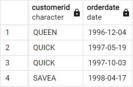

What issues will you address by cleaning the data?


Queries:
Below, provide the SQL queries you used to clean your data.


select * from orders where shipregion is not null

select * FROM orders where shipvia = 2

select * from order_details where discount > 0

---

### Removing NULL shipregion
Some of the shipregion values are null and we need to remove them in some queries. Here is an example of doing that:

```sql
SELECT
	*
FROM
	orders
WHERE
	shipregion IS NOT NULL
```

### Keeping only high-freight orders
We only want orders where the freight is greater than $800. Here is how we can do that:

```sql
SELECT customerid, orderdate FROM orders WHERE freight > 800
```

| customerid | orderdate |
|-|-|
| QUEEN | 1996-12-04 |
| QUICK | 1997-05-19 |

